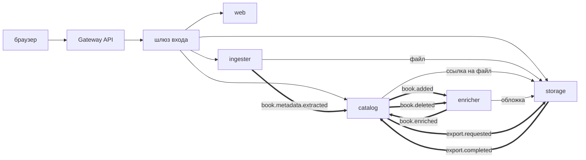

# Устройство системы

Документ отвечает на три вопроса: из чего система состоит, как части разговаривают между собой
и почему границы проведены именно так. Как это запускать — в корневом `README.md`; почему выбраны
конкретные версии — в `docs/decisions/compatibility.md`; отдельные решения с разбором
рассмотренных вариантов — в остальных записях `docs/decisions/`.

## Задача

Личное хранилище электронных книг. Файлы приходят как есть — с непонятными именами, часто без
метаданных внутри. Система сама определяет формат по содержимому, вынимает что может, дополняет
недостающее из внешних справочников, приводит к единому виду и складывает книгу в каталог,
по которому можно искать, отбирать и скачивать под аккуратным именем.

Библиотека личная: пользователь видит только свои книги. Это не роль и не право, а свойство
данных — у каждой записи есть владелец, и запрос без него не выполняется.

## Части

| Сервис | Чем владеет | За что отвечает |
| --- | --- | --- |
| `catalog` | карточки книг, авторы, темы, подборки, полка, задачи выгрузки | каталог и поиск, права владельца, сборка имени файла, выгрузка библиотеки |
| `storage` | файлы, обложки, ссылки на них, архивы | приём потоком, дедупликация по содержимому, выдача, подписанные ссылки, сборка архивов |
| `ingester` | задачи разбора | определение формата по содержимому, извлечение метаданных, приведение к общему виду |
| `enricher` | задачи уточнения, память ответов справочников | походы в Google Books и Open Library, сверка кандидатов, обложки |
| `web` | — | пять статических страниц: каталог, карточка, загрузка, полка, выгрузка |

Границы проведены по владению данными, а не по слоям и не по «сущностям». Проверка простая:
у каждой таблицы ровно один сервис, который в неё пишет. Поэтому `storage` ничего не знает
о книгах — он знает о байтах и о том, у кого на них есть ссылка, — а `catalog` не знает,
где лежат файлы, и спрашивает у `storage` ссылку, когда она нужна.

Своего написанного шлюза нет: снаружи стоит `Gateway API` (Envoy Gateway) и шлюз входа
(oauth2-proxy). Причина в записи `docs/decisions/03-vhod-i-vladenie.md`.

## Как части разговаривают

Два способа, и выбор между ними не стилистический.

**Синхронно (HTTP)** — когда ответ нужен прямо сейчас и обратиться больше не к кому:
`ingester` забирает файл у `storage`, `catalog` просит у `storage` ссылку на скачивание,
`enricher` кладёт обложку в `storage`. Все такие вызовы идут с токеном обратившегося или
служебной учётной записью — сервисы не доверяют друг другу «по сети».

**Событиями (Kafka)** — когда работа занимает время или получателей может стать больше:
разбор файла, заведение карточки, уточнение метаданных, сборка архива. Отправитель не ждёт
и не знает, кто прочтёт.



Сплошные стрелки — вызовы, двойные — события. Наружу, в интернет, ходит только `enricher`;
сетевые политики в кластере это и предписывают.

## Путь книги

1. Браузер кладёт файл в `storage` (`POST /api/v1/files`). Файл читается потоком, по дороге
   считаются SHA-256, контрольная сумма и размер. Если такие байты уже лежат, второй объект
   не создаётся — появляется ещё одна ссылка на тот же.
2. Браузер просит разобрать содержимое (`POST /api/v1/ingestions`, в теле — хэш и исходное имя).
   `ingester` заводит задачу и отвечает сразу: разбор идёт своим ходом.
3. `ingester` забирает файл, определяет формат по содержимому (расширение может врать или
   отсутствовать), вынимает метаданные, приводит их к общему виду — язык из «eng» и «Russian»
   в «en» и «ru», автор из «ПЕТРОВ И.И.» в «Петров И. И.» — и отправляет `book.metadata.extracted`.
4. `catalog` заводит карточку. Если у владельца уже есть книга с этим файлом, вторая карточка
   не появляется. Отправляет `book.added`.
5. `enricher` дополняет пустые и угаданные из имени поля по справочникам, забирает обложку и
   отправляет `book.enriched`. Поля, вынутые из файла и правленные владельцем, он не трогает:
   у каждого поля записан источник.
6. Владелец скачивает книгу: `catalog` собирает имя по схеме «автор — серия — название (год)»
   и выдаёт подписанную ссылку на минуту. По ней `storage` отдаёт байты без заголовка с токеном.

Один и тот же идентификатор запроса проходит все четыре сервиса и обе передачи через Kafka,
поэтому путь читается как одна история и в журнале, и в трассе.

## Как всё устроено внутри одного сервиса

Раскладка одинаковая и следует владению, а не слоям:

```
controller/   входные точки HTTP
service/      правила предметной области; state/ — состояния процессов
repository/   доступ к своим таблицам
client/       обращения к чужим службам (по подпапке на источник)
messaging/    отправка и приём событий
dto/          то, что уходит наружу и приходит снаружи
config/       настройки и объявления bean-компонентов
```

Общее вынесено в `shared/`, и только то, расхождение в чём было бы не разнобоем в стиле,
а дырой или несовместимостью: `shared/security` — проверка токена, `shared/events` — описания
событий, `shared/metadata` — приведение значений к общему виду.

## Данные

| Где | Что лежит |
| --- | --- |
| PostgreSQL, база на сервис | карточки, файлы и ссылки, задачи разбора, задачи уточнения и память ответов |
| SeaweedFS (S3) | сами книги, обложки, собранные архивы |
| Kafka | события; у каждого потребителя своя очередь повторов и своя очередь неразобранного |
| Valkey | сессии шлюза входа — единственное, что там хранится |

База у каждого сервиса своя, с собственной ролью: заглянуть в чужие таблицы нельзя даже
по ошибке. Схемы ведёт Liquibase, миграции применяются при запуске сервиса.

## Поиск

Поиск по каталогу собран из двух механизмов. Полнотекстовый — по названию, авторам, серии и
издательству, с учётом словоформ («запросов» находит «запрос»). Триграммный — на случай опечатки
в одну-две буквы. К ним добавлены разделы отбора (формат, тема, язык, полка) со счётчиками
и постраничность по ключу, а не по смещению: страница не «съезжает», когда во время просмотра
добавляется новая книга.

Темы — плоский словарь: у книги их несколько, дерево предполагало бы одно место.

## Безопасность

Три правила, на которых всё держится:

- **Владелец — из токена, никогда из запроса.** Чужая книга отвечает 404, тем же, чем
  несуществующая: 403 сообщал бы, что такая книга есть.
- **Каждый сервис проверяет токен сам** — подпись по ключам издателя, издателя, получателя, срок.
  То, что проставил шлюз, для сервиса — обычные данные от клиента.
- **Файлы отдаются по подписанной ссылке**, а не по «секретному» адресу: в пропуске записано,
  на какой файл и кому он выписан и до какого момента действует.

Подробности — в `README.md`, раздел «Безопасность», и в записи `docs/decisions/03-vhod-i-vladenie.md`.

## Наблюдаемость

У каждого сервиса отдельный порт (8081) для проб, метрик и сведений о сборке — наружу он
не выставлен. Метрики забирает Prometheus, трассы уходят по OTLP в Tempo, журнал печатается
структурой ECS. Идентификатор запроса связывает журнал и трассу, а деления гистограмм несут
примеры — из точки на графике открывается тот самый запрос, который в неё попал.

Два дашборда — «сервисы» и «путь книги» — лежат в чарте одним файлом на оба окружения.

## Развёртывание

Стенд на compose и кластер собраны из одних и тех же образов и настроены одинаково там, где
расхождение молча меняло бы поведение: частота съёма метрик, приёмник трасс, формат журнала,
метки метрик, описание realm.

В кластере: платформа — зонтичный чарт из upstream-чартов (Keycloak, oauth2-proxy, Valkey,
SeaweedFS, Prometheus, Grafana, Tempo) плюс объекты операторов CloudNativePG и Strimzi;
приложение — пять релизов одного общего чарта `service` со своими значениями. Единица выката —
сервис, а не приложение целиком.

## Что сознательно не сделано

- **Поиск по содержимому книг.** Форматы с готовым текстом дали бы его почти даром, но половина
  корпуса — сканы, а это OCR: отдельный образ, минуты процессора на книгу и неровное качество.
- **Несколько копий каждого сервиса.** Стенд одноузловой; в остальном ничто этому не мешает —
  сервисы не держат состояния между запросами.
- **Ограничение частоты запросов на входе.** Отмечено в README как обязательное для настоящего
  окружения; от перебора паролей защищает Keycloak, поток запросов к API сейчас не ограничен.
- **TLS на стенде.** Обязателен в настоящем окружении: слушатель HTTPS у шлюза, `cookie_secure`,
  внешний адрес на `https://` — он же попадёт в токены как издатель.
